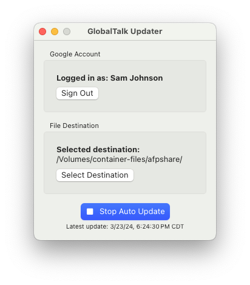

# GlobalTalk Updater

GlobalTalk Updater is a macOS app for generating a list of GlobalTalk host IP addresses, which [AIRConfig](https://mastodon.social/@kalleboo@bitbang.social/112145910679083054) can import into Apple Internet Router for connecting to GlobalTalk.

## Requirements

- macOS 13.0 or later
- Google account
- Access to the GlobalTalk Google Sheet

## Usage instructions

1. [Download the latest release](https://github.com/dremin/globaltalk-updater/releases/latest)
2. Open GlobalTalk Updater, then click the button to sign in to your Google Account which has access to the GlobalTalk spreadsheet.
3. Follow through the prompts to grant access to GlobalTalk Updater. The app will only use this access to read from the GlobalTalk spreadsheet.
4. Once signed in, click "Select Destination" to select where it should save files. This location should be something accessible by your AIR router, such as a Netatalk share.
5. Click "Start Auto Update" to generate the list. It will save a file named "GlobalTalk IP List.txt" every 10 minutes in the selected location.
6. On your AIR router, open AIRConfig, which you can find on the BaroNet zone.
7. In AIRConfig, select the file generated by GlobalTalk Updater as the host ID file, and select your AIR config file, then click Convert.
8. Restart your Apple Internet Router to pick up the changes.

