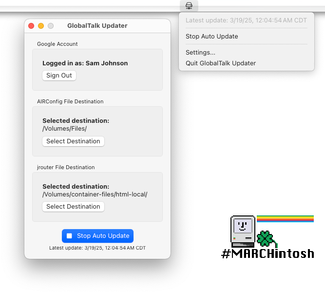

# GlobalTalk Updater

GlobalTalk Updater is a macOS app for generating a list of [GlobalTalk](https://marchintosh.com/globaltalk.html) router IP addresses, which can be imported into [jrouter](https://gitea.drjosh.dev/josh/jrouter), or Apple Internet Router using [AIRConfig](https://mastodon.social/@kalleboo@bitbang.social/112145910679083054).

Created for [#MARCHintosh](https://marchintosh.com/) 2024 and 2025.

## Requirements

- macOS 13.0 or later
- Google account
- Access to the GlobalTalk Google Sheet

## Usage instructions

1. [Download the latest release](https://github.com/dremin/globaltalk-updater/releases/latest)
2. Open GlobalTalk Updater, then click the button to sign in to your Google Account which has access to the GlobalTalk spreadsheet.
3. Follow through the prompts to grant access to GlobalTalk Updater. The app will only use this access to read from the GlobalTalk spreadsheet.
4. The next steps depend on if you're using jrouter or Apple Internet Router (or, you can generate files for both):
   1. For jrouter:
      1. Once signed in, click "Select Destination" under the "jrouter File Destination" section to select where it should save files. This location should be accessible by a local web server, which jrouter will use to load the file.
      2. Click "Start Auto Update" to generate the list. It will save a file named "GlobalTalk_jrouter.txt" every 10 minutes in the selected location.
      3. In your jrouter.yaml configuration file, set `peerlist_url` to the web server address of `GlobalTalk_jrouter.txt`.
      5. Restart jrouter to pick up the changes.
   2. For Apple Internet Router:
      1. Once signed in, click "Select Destination" under the "AIRConfig File Destination" section to select where it should save files. This location should be something accessible by your AIR router, such as a Netatalk share.
      2. Click "Start Auto Update" to generate the list. It will save a file named "GlobalTalk IP List.txt" every 10 minutes in the selected location.
      3. On your AIR router, open AIRConfig, which you can find on the BaroNet zone.
      4. In AIRConfig, select the file generated by GlobalTalk Updater as the host ID file, and select your AIR config file, then click Convert.
      5. Restart your Apple Internet Router to pick up the changes.